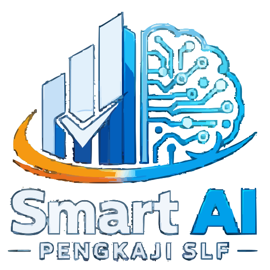

<div align="center">
  
  <h1>🏢 Smart AI Pengkaji SLF</h1>
  <p><strong>Sistem Pakar Berbasis AI untuk Audit Forensik & Pengkajian Teknis Sertifikat Laik Fungsi (SLF) Bangunan Gedung</strong></p>
  
  <p>
    
    
    
    
    
    
  </p>
</div>

---

## 📖 Deskripsi

**Smart AI Pengkaji SLF** adalah platform *forensic engineering* berbasis AI yang dirancang untuk mengotomatisasi proses pengkajian teknis Bangunan Gedung (SLF) di Indonesia sesuai **PP No. 16 Tahun 2021 (NSPK PUPR)** dan standar terkini.

### Standar Regulasi yang Diimplementasikan

| Standar | Deskripsi |
|---------|-----------|
| **PP No. 16/2021** | NSPK PUPR - Persyaratan Sertifikat Laik Fungsi |
| **SNI 1726:2019** | Tata cara perencanaan ketahanan gempa |
| **SNI 6197:2011** | Penerangan alami pada bangunan gedung |
| **PUIL 2020** | Persyaratan umum instalasi listrik |
| **ASCE 41-17** | Seismic Evaluation and Retrofit of Existing Buildings |
| **SNI 8131:2015** | Aksesibilitas pada bangunan gedung |

---

## ✨ Modul Pengkajian Lengkap (12 Aspek SLF)

### 🏛️ 1. Arsitektur
- Kesesuaian rencana tapak
- Intensitas bangunan (KDB, KLB, KDH)
- Jalur evakuasi dan keluar
- Persyaratan arsitektural

### �️ 2. Struktur Bangunan
- **ASCE 41-17 Tier Evaluation**: Tier 1 (Screening), Tier 2 (Evaluation), Tier 3 (Detailed)
- **NDT Testing**: Rebound Hammer Test (ASTM C805) & UPV Test (ASTM C597)
- **Seismic Analysis**: Perhitungan parameter seismik SNI 1726:2019
- **ETABS Integration**: Import dan analisis model struktur
- **Pushover Analysis**: Analisis performa gempa non-linear

### 🔌 3. Sistem Kelistrikan
- Panel Management (MDB, SMDB, DB)
- Load Analysis real-time (Safe/Warning/Overload)
- Thermal Imaging untuk deteksi hotspot
- Protection Coordination (MCB/MCCB)
- Data Logger Import (CSV/Excel)
- Simulasi: MCB Upgrade, Load Transfer, Cable Sizing

### 🔥 4. Proteksi Kebakaran
- Klasifikasi bahaya kebakaran
- Sistem deteksi dan alarm
- Sistem sprinkler dan hidran
- Perhitungan egress capacity
- Kompartementasi

### ⚡ 5. Proteksi Petir
- Risk assessment SNI 2848:2020
- External LPS (air terminal, down conductor)
- Internal LPS
- Surge Protection Device (SPD)

### 💧 6. Sistem Air Bersih
- Perhitungan kebutuhan air
- Sumber air dan distribusi
- Kapasitas tangki penyimpanan
- Tekanan dan debit

### 🚿 7. Sistem Air Kotor & Sanitasi
- Sistem pembuangan air limbah
- Ventilasi plumbing
- Perhitungan unit plumbing fixture

### ♿ 8. Aspek Kemudahan (Aksesibilitas)
- Ramp dan kemiringan (SNI 8131:2015)
- Lebar tangga, koridor, pintu
- Fasilitas difabel
- Elevator dan eskalator

### 🌡️ 9. Aspek Kenyamanan
- Pencahayaan alami dan buatan
- Penghawaan alami
- Suhu dan kelembaban
- Kebisingan (dB)

### 🌧️ 10. Pengelolaan Air Hujan
- Drainase permukaan
- Sistem resapan
- Sistem detensi/retensi
- Perhitungan runoff

### 🌍 11. Pengendalian Dampak Lingkungan
- Dampak udara, air, tanah
- Kebisingan lingkungan
- Manajemen sampah

### 🌊 12. Mitigasi Bencana
- Analisis risiko gempa (INARisk integration)
- Peta bahaya bencana
- Rencana mitigasi

---

## 🧠 Fitur AI & Smart Engine

### Multi-Model AI Router
- **Primary**: Google Gemini 2.0, Mistral Large
- **Alternative**: OpenAI GPT-4o, Claude 3.5 Sonnet
- **Vision**: Pixtral 12B, Gemini Vision untuk deteksi kerusakan visual
- **Failover**: Otomatis switch ke model alternatif jika primary gagal

### SmartAI Pipeline
- **Document Analysis**: OCR + AI untuk ekstraksi data dari PDF/DWG
- **Image Analysis**: Deteksi kerusakan struktural dari foto
- **Report Synthesis**: Auto-generate BAB IV - Analisis dan Evaluasi
- **RAG Engine**: Retrieval Augmented Generation untuk referensi standar

### Forensic 1:1 UI
- Yellow Block design system (sesuai standar PUPR)
- Multi-sample point inspection
- Audit trail dan versioning

---

## 🛠️ Stack Teknologi

| Kategori | Teknologi |
|----------|-----------|
| **Build Tool** | Vite 6.0 |
| **Database** | Supabase (PostgreSQL + RLS) |
| **3D Visualization** | Three.js |
| **Machine Learning** | TensorFlow.js |
| **AI/ML Models** | Transformers.js (Xenova) |
| **Charts** | Chart.js |
| **Document** | DOCX, DOCXTemplater, PizZip |
| **PDF** | jsPDF, jsPDF-AutoTable |
| **OCR** | Tesseract.js |
| **Storage** | Google Apps Script (Drive Proxy) |
| **DXF Parsing** | dxf-parser |
| **State** | IDB (IndexedDB) |

---

## 📂 Struktur Proyek (Clean Architecture)

```
src/
├── application/          # Use Cases & DTOs
│   ├── dto/
│   ├── mappers/
│   └── use-cases/
├── components/           # UI Components (30+ modul)
│   ├── common/
│   └── workspace/
├── core/                 # Smart AI Core Engine
│   └── smart-ai/
├── domain/               # Entities & Business Rules
│   ├── entities/
│   └── errors/
├── engine/               # Simulation Engines
├── infrastructure/       # External Services
│   ├── ai/
│   ├── persistence/
│   ├── pipeline/
│   └── security/
├── lib/                  # Utilities & Services (115+ file)
│   ├── docx/
│   ├── evacuation/
│   ├── fire/
│   └── archsim/
├── modules/              # Domain Modules
│   ├── disaster/
│   ├── plumbing/
│   └── stormwater/
├── pages/                # Page Controllers (50+ halaman)
│   └── laporan/
├── services/             # Application Services
├── styles/               # CSS Design System
└── tests/                # Test Suite
```

---

## 🚀 Panduan Memulai

### 1. Instalasi
```bash
git clone https://github.com/bangPUPR/Pengkaji-smart-AI.git
cd Pengkaji-smart-AI
npm install
```

### 2. Konfigurasi Environment
Buat file `.env` di root:

```env
# Supabase
VITE_SUPABASE_URL=https://your-project.supabase.co
VITE_SUPABASE_ANON_KEY=your-anon-key

# AI Providers (minimal 1)
VITE_GEMINI_API_KEY=...
VITE_MISTRAL_API_KEY=...
VITE_OPENAI_API_KEY=...
VITE_CLAUDE_API_KEY=...
VITE_OPENROUTER_API_KEY=...

# Google Integration
VITE_GOOGLE_APPS_SCRIPT_URL=...
VITE_GOOGLE_DOC_TEMPLATE_ID=...
VITE_GCP_API_KEY=...
```

### 3. Jalankan Development
```bash
npm run dev
```

### 4. Build Production
```bash
npm run build
```

### 5. Deploy Google Apps Script
```bash
npm run deploy-gas
```

---

## 🔄 CI/CD (GitHub Actions)

Workflow otomatis saat push ke branch `main`:

1. **Install dependencies**
2. **Deploy Supabase Edge Functions** (AI Proxy)
3. **Build aplikasi** (Vite)
4. **Deploy ke GitHub Pages**

Lihat `.github/workflows/deploy.yml` untuk detail.

---

## 📄 Lisensi & Disclaimer

Sistem ini adalah alat bantu (*Expert Support System*). Seluruh output yang dihasilkan oleh AI tetap memerlukan validasi dan pengesahan akhir oleh **Insinyur Pengkaji Berlisensi**.

---

<div align="center">
  <p>Dikembangkan oleh <strong>Tim Smart AI Pengkaji</strong></p>
  <p>&copy; 2026 - Forensic AI Building Audit System</p>
</div>
